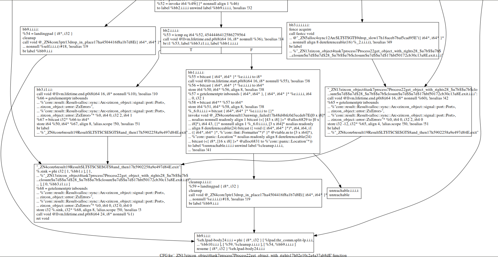

### 这是分析zircon-loader时的到的一张示例control_flow_graph：



### 什么是CFG（control flow graph）
一个CFG是表示一个方法内的程序执行流的图，图中的节点是语句（指令），边表示执行流。例如语句A执行后的下一条语句是B，则CFG中应有一条从A到B的有向边。条件语句（if-else, while-do）之后可能执行的语句不止一个，可能执行true-branch或false-branch，所以CFG上条件语句节点的后缀会有多个，表示其后可能执行的不同branches。

### 获得CFG的方式
可以套用
[call_graph_analyzer.md](call_graph_analyzer.md)

第6部以后的操作.
只需把`-dot-callgraph `更改为`-dot-cfg`即可
```sh
$ llvm9/build/bin/opt -dot-callgraph zircon_loader-aee642b49f6df21b.bc
```

> 注意此时生成的所有dot图搜是隐藏的
> 
> 我们可以单独分析每一个函数结点内部的程序流；
