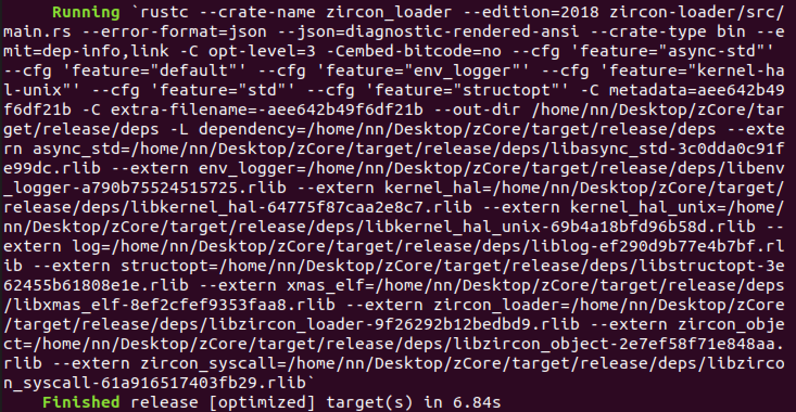
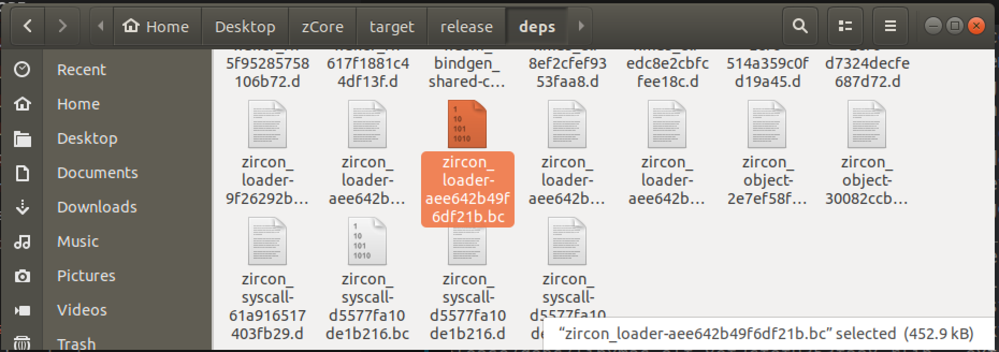
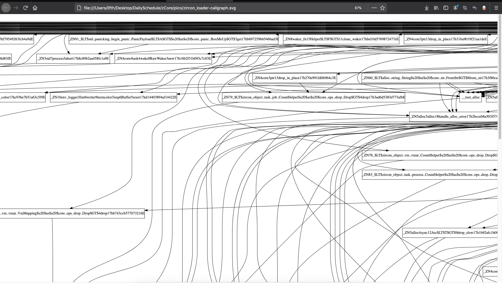

### Clone zCore repo and pull prebuilt fuchsia images:
```sh
$ git clone https://github.com/rcore-os/zCore --recursive
$ cd zCore
$ git lfs install
$ git lfs pull
```

### Run native Zircon program (shell):
原来的命令：
```sh
cargo run --release -p zircon-loader prebuilt/zircon/x64
```
现改为获得zircon-loader的LLVM-BitCode：
1. cargo 中不能直接添加 `--emit=llvm-bc` 或者是 `--emit=llvm-bc`这些参数以获得中间代码，这些额外的参数只能写到rustc命令行中
2. 因此需要获得cargo build获得最终可执行的binary：`zircon-loader`的时候的rustc 编译命令行  
   在cargo build 中添加 `-v` 参数便可实现
```shell
$ cargo build --release -p zircon-loader -v
```
 

3. 此时需要在rustc之后的`--emit=...`参数后追加 `llvm-bc` 或者 `llvm-ir`
4. 将上述修改后的rustc命令行在zCore目录下再次运行
```shell
   rustc --crate-name zircon_loader --edition=2018 zircon-loader/src/main.rs --error-format=json --json=diagnostic-rendered-ansi --crate-type bin --emit=dep-info,link,llvm-bc -C opt-level=3 -Cembed-bitcode=no --cfg 'feature="async-std"' --cfg 'feature="default"' --cfg 'feature="env_logger"' --cfg 'feature="kernel-hal-unix"' --cfg 'feature="std"' --cfg 'feature="structopt"' -C metadata=aee642b49f6df21b -C extra-filename=-aee642b49f6df21b --out-dir /home/nn/Desktop/zCore/target/release/deps -L dependency=/home/nn/Desktop/zCore/target/release/deps --extern async_std=/home/nn/Desktop/zCore/target/release/deps/libasync_std-3c0dda0c91fe99dc.rlib --extern env_logger=/home/nn/Desktop/zCore/target/release/deps/libenv_logger-a790b75524515725.rlib --extern kernel_hal=/home/nn/Desktop/zCore/target/release/deps/libkernel_hal-64775f87caa2e8c7.rlib --extern kernel_hal_unix=/home/nn/Desktop/zCore/target/release/deps/libkernel_hal_unix-69b4a18bfd96b58d.rlib --extern log=/home/nn/Desktop/zCore/target/release/deps/liblog-ef290d9b77e4b7bf.rlib --extern structopt=/home/nn/Desktop/zCore/target/release/deps/libstructopt-3e62455b61808e1e.rlib --extern xmas_elf=/home/nn/Desktop/zCore/target/release/deps/libxmas_elf-8ef2cfef9353faa8.rlib --extern zircon_loader=/home/nn/Desktop/zCore/target/release/deps/libzircon_loader-9f26292b12bedbd9.rlib --extern zircon_object=/home/nn/Desktop/zCore/target/release/deps/libzircon_object-2e7ef58f71e848aa.rlib --extern zircon_syscall=/home/nn/Desktop/zCore/target/release/deps/libzircon_syscall-61a916517403fb29.rlib
```

5. 此时可以在 `zCore/target/release/deps`目录下获得如下bc code：`zircon_loader-aee642b49f6df21b.bc`  

  

6. 下一步运行llvm的opt程序：
```sh
$ llvm9/build/bin/opt -dot-callgraph zircon_loader-aee642b49f6df21b.bc
```
此时会获得一个callgraph.dot的文件  

> 必须使用最新的llvm 9+ 版本的opt程序，不然opt程序无法分析rust-llvm 10+生成的bitcode
> 从llvm 的source code编译的过程为：

(以编写如下shell脚本（配合ninja），方便一键部署)

```shell
#!/bin/bash
#cd COMPILER_DIR
#./project_init_scripts/init_llvm9.sh

set e, x
COMPILER_DIR=$(readlink -f `dirname $0`/..)
PROJECT_ROOT_DIR=`dirname ${COMPILER_DIR}`
THIS_DIR=`dirname \`readlink -f $0\``
LLVM9_DIR=${PROJECT_ROOT_DIR}/llvm9/
SYM_LINK='ln -sfn'


#################################  SETUP LLVM9/CLANG9  #################################
######################################-project llvm##########################################
if [ !  -e ${LLVM9_DIR} ]
then
  cd ${PROJECT_ROOT_DIR}
  git clone https://gitee.com/ilfth/llvm-project 
  mv llvm-project llvm9
  bash ${PROJECT_ROOT_DIR}/compiler/analysis/def_use/setup_symlinks.sh
  cd llvm9
  mkdir build
  cd build 
  cmake ../llvm \
    -GNinja \
    -DLLVM_BINUTILS_INCDIR=${PROJECT_ROOT_DIR}/gcc/gcc-arm-none-eabi-6-2017-q1-update/src/binutils/include \
    -DLLVM_ENABLE_PROJECTS="clang;compiler-rt;lld" \
       -DCMAKE_BUILD_TYPE=Debug \
       -DCMAKE_C_COMPILER=clang \
       -DCMAKE_CXX_COMPILER=clang++ \
       -DLLVM_ENABLE_ASSERTIONS=ON  \
       -DLLVM_BUILD_TESTS=OFF  \
       -DLLVM_BUILD_EXAMPLES=OFF  \
       -DLLVM_INCLUDE_TESTS=OFF \
       -DLLVM_INCLUDE_EXAMPLES=OFF \
       -DLLVM_TARGETS_TO_BUILD="X86;ARM" \
       -DBUILD_SHARED_LIBS=ON  \
       -DLLVM_BINUTILS_INCDIR=/usr/include \
       -DCMAKE_INSTALL_PREFIX=../bin \
       -DCMAKE_C_FLAGS=-fstandalone-debug \
       -DCMAKE_CXX_FLAGS=-fstandalone-debug
  ninja
fi

################################################################################

```

1. 这个callgraph.dot文件包含了图中所有的结点和边的信息，可以利用`dot`命令将它转变为可视化的png/pdf/svg...等格式的图片，方便阅读。  
   如：  
```sh
$ dot -Tsvg callgraph.dot -o callgraph.svg
```
8. 在运行获得对应名称的svg图后，可以用常规的浏览器打开阅读：  
   
> 此时我们可以从图中分析得出zircon-loader中的每一个结点之间的相互调用关系。
